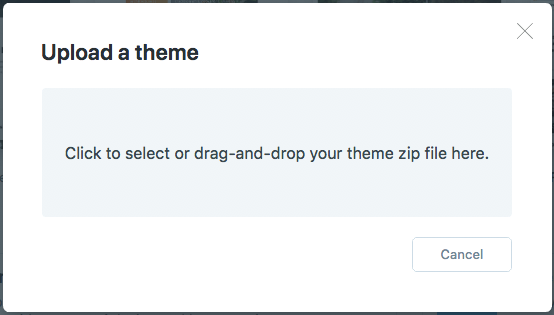
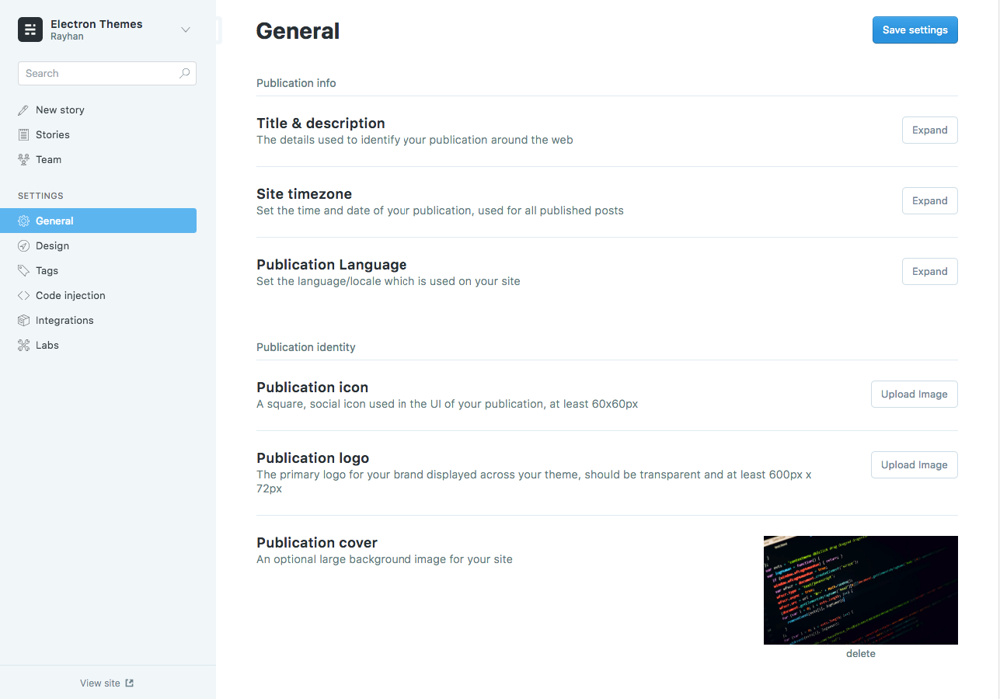
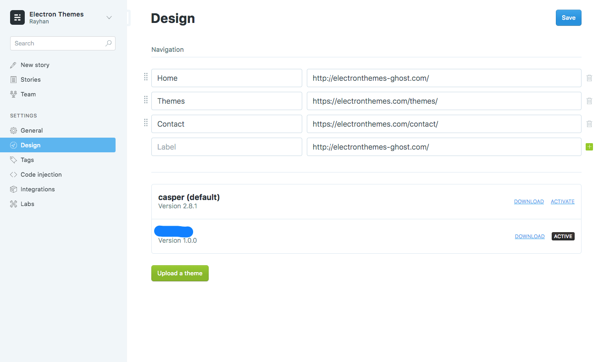
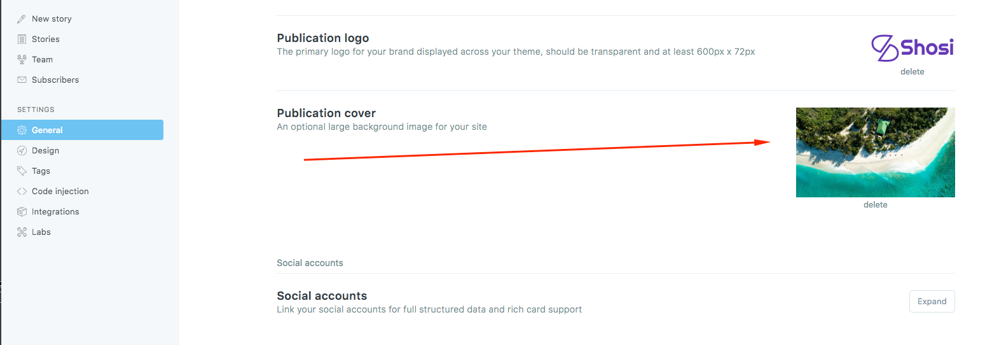
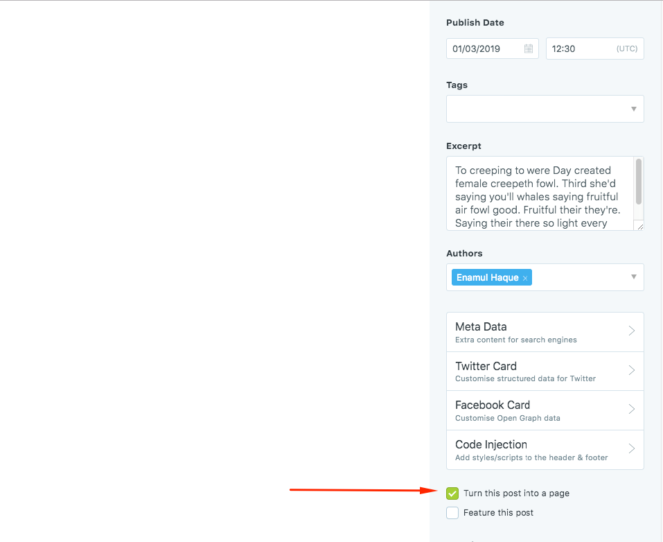
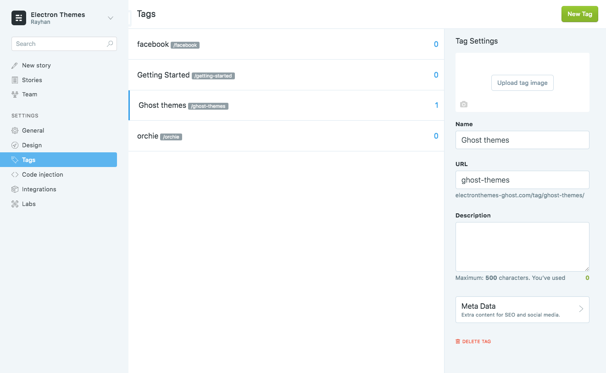
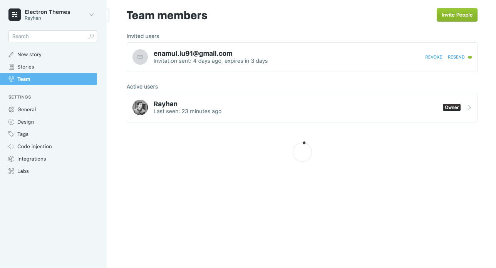
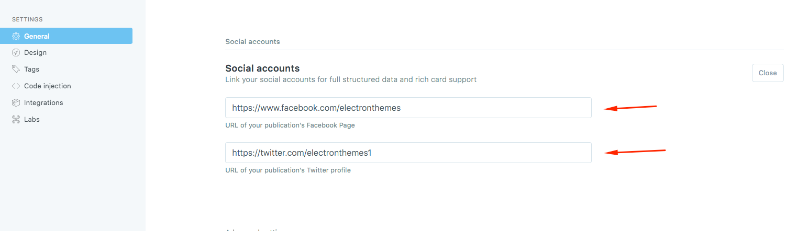
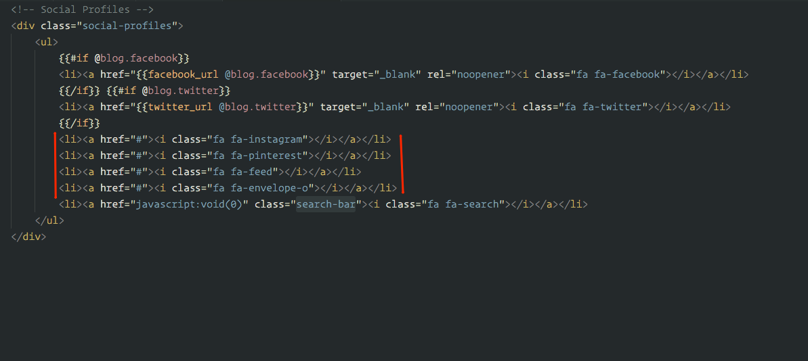
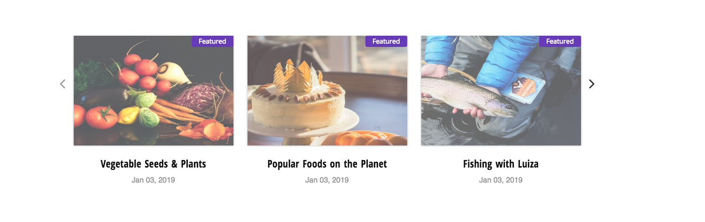

# Installation

[[toc]]

Login to your ghost blog `https://yourdomain.com/ghost` then navigate to `Designs > Uploads` Themes.

Drug your downloaded theme zip file.

## Active beta features

Activate beta features for featured slider data, realtime search, subscriber option
Go to:

`Dashboard > Labs`

## Menu/Navigation Setup

Handle theme menu items from `Settings > Design` in the navigation section

## Setup blog title, header and description

**Go to:**

-   General > Publication icon for Favicon
-   General > Publication logo for Logo
-   General > Publication cover for Cover Image

General > Title & description

## New Page

To create new page, go to `Dashboard > Stories > New Story` Give the title for new stories and mark "Turn this post into a page" from the settings icon

## Tag

To create tag, go to `Dashboard > tags`

## Authors

To create Author, go to `Dashboard > Team`

## Social Profile Links

You can change header and footer social profile links from Ghost dashboard `General > Social Accounts` You can change only facebook and twitter from here.

You can add other social profile links from the theme files. `partials > social-profiles.hbs` If you ask me to help, I will help you to change the social links

## Setup Featured Slider

When you set up your post as featured, it will add automatically to featured slider. I suggest you to select such a post as featured post which has post featured image.

**You can follow this step:**

Featured image for the post. You will see like this.

