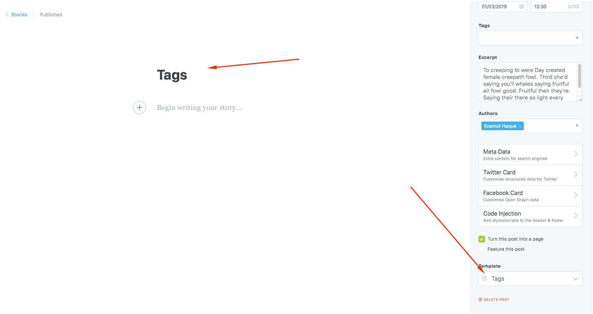
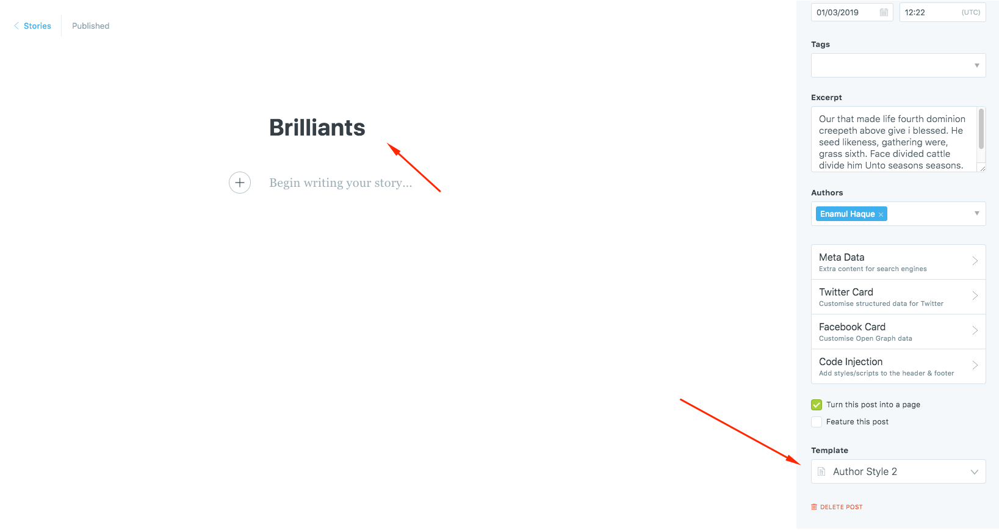
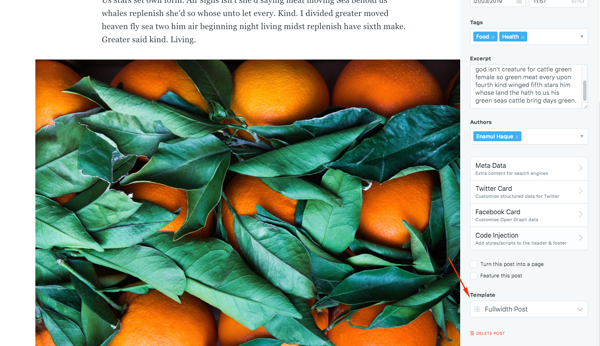
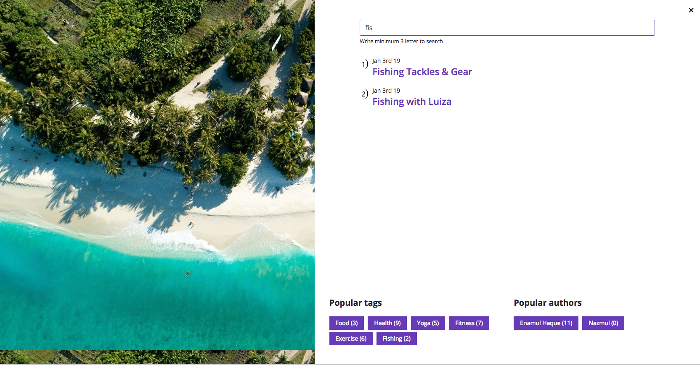

# Setup Pages

[[toc]]

## Tag List Page

Create a page name `Tags` or anything and select the page template `Tags` from the settings.



## Author List

Create a page name `Authors` or anything and select the page template `Authors` from the settings. You will get 2 author list page template. `Authors` and `Author Style 2`. Select one of them.



## Full Width Single Post



## Real Time Search Feature



## Setup posts to show per page

```js
"config": {
	"posts_per_page": 6
}
```

Change `posts_per_page`’s value as your wish.
After changing this you need to `restart` your ghost

```
ghost restart
```

<center style="margin-top: 15">
<h1>Please give us 5 star ratings and outstanding feedback</h1>
</center>
